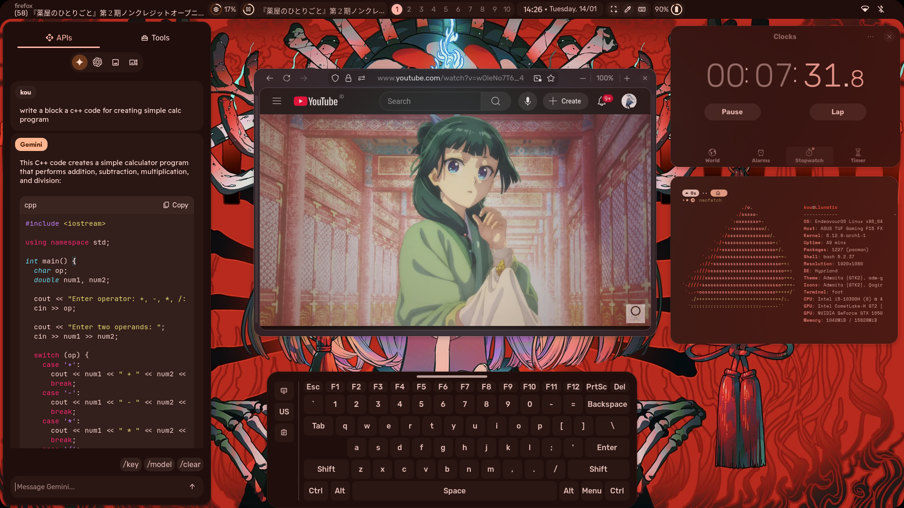
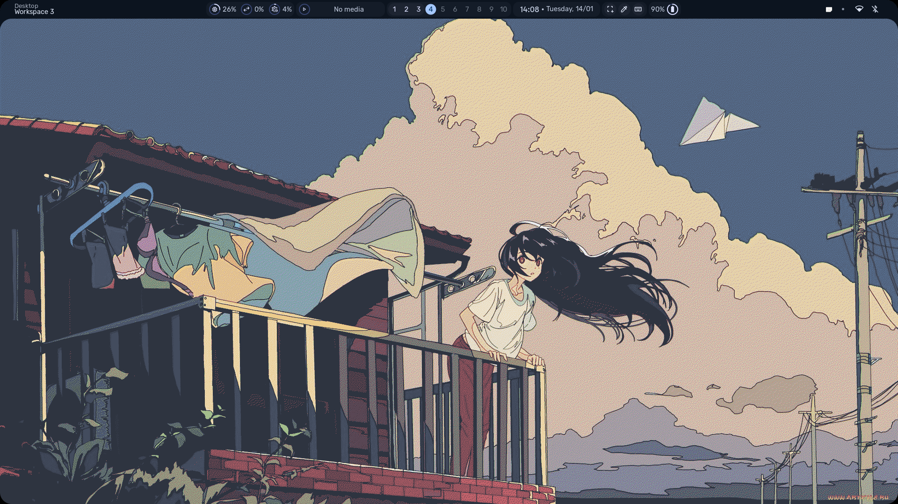

# My Arch Linux Dotfiles

Welcome to my personal dotfiles repository! This repository contains the configuration files for my Arch Linux setup. These are tailored to my workflow and preferences. Feel free to explore and adapt them for your own use.

---

## Preview
Here's an overall look at my desktop setup:

---

## Applications & Configurations

### Hyprlock
A minimal and elegant screen locker. Configurations and assets are in the `hyprlock/` folder.

---

## Notes
- These dotfiles are constantly evolving as I tweak my setup.
- Designed for use on Arch Linux with Hyprland.

---

## License
This repository is under the MIT License. Feel free to use and modify these files to suit your needs.
